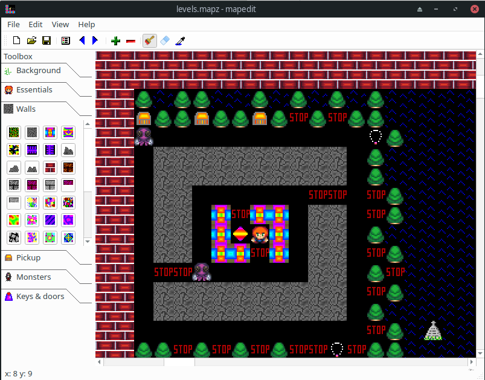

# cs3-map-edit

## Map Editor for CS3

### Preview map in the editor.

### Runtimes available

#### ESP32

https://github.com/cfrankb/esp-idf-cs3

#### ESP32S3 VGA

https://github.com/cfrankb/ESP32-S3-VGA-CS3

##### RP2040

https://github.com/cfrankb/cs3_rp2040_pico

##### MSDOS (legacy v1)

online runtime: https://cfrankb.com/games/msdos/cs3.html

source code: https://github.com/cfrankb/monstics/tree/master/src/msdos/games

##### Runtime V2

online runtime: https://cfrankb.com/games/ems/cs3v2.html

source code: https://github.com/cfrankb/cs3-runtime-sdl
