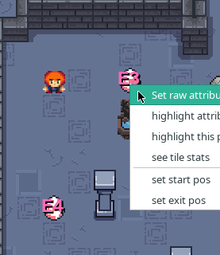
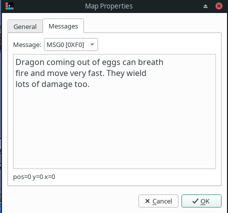

# CS3 Map Edit

Game specification reference for map editing, covering level mechanics and tile attributes.

## Game Mechanics Overview

Any consumable , when assigned an attribute (attributes `01-1F` and `40-4F` -- see table below), will make matching tiles with the same attribute disappear.

| Tile | Behavior |
|------|----------|
| diamonds | must be collected to complete the level. health bonus |
| Flowers & mecklaces| health bonus
| chute | drops to the next level (same X, Y coordinates) |
| ice cubes | can be pushed onto monster |
| exploding barrels | can damage nearby enemies and player |
| water / swamp | causes health damage to player |
| boat | grants immunity to water (one-time consumable) |
| boulder | can be pushed |
| dragon egg | spawns dragon |
| keys and doors | allow/block player (deny access) |
| monsters | regular mobs are variations of basic AI |
| bosses | special pathfinding algorithm
| vines | damages player, can swallow other monsters and spread through water |
| blue mushroom | extra life (one-time consumable) |
| green mushroom | rage??? TBD |
| red mushroom | invincibility / god mode (one-time consumable) |
| yellow mushroom | sugar rush (one-time consumable) |
| fruits | give player sugar rush |
| scrolls | messages (lore) |
| treasures | gold / points |
| stop | deny monster access |

### Level Enter / Exit

- Define where the player starts and exits.
- If an exit is defined, the player must exit at X, Y.
- Either use the start position or the player tile to mark the spawn point.

## Game Objective

The game objective is to collect all the diamonds.

Some levels may have an exit door location defined (per level settings).

Avoid monsters and other hazards.

Map can have a set goal (number of diamonds to collect) or default is all diamonds.
You can set a timeout for the map.

## Instructions

Right click on a tile to modify the attribute

Scroll messages are defined using attribute `F0...FF`

## Main Layer Tiles

Main layer tiles are located on the left (main tileset).
Tiles for the Floor and Walls are located in the right (toolbox).

## Map Editor Tools

| Tool | Description |
|------|-------------|
| Stamp | stamp the selected tile |
| Eraser | erase a tile |
| Picker | pick a tile to reuse |
| Select | select a region |
| Random Mode (Dices) | place tiles randomly |
| Flood Fill | fill an area with a tile |

## Game Rules

| Rule | Description |
|------|-------------|
| Vine | unconstrained. It can latch onto monsters and spread through water. If either condition is met it grows. |
| Chute | The chute target on the next level matches the location of the chute (X, Y). |
| Exit rule | Optional. Classic levels didn't have any exit location. This was added recently. |
| Sugar rush | Makes the player move faster for a brief duration of time. |
| Green mushroom | Are for rage, but this behavior is not clearly defined yet. |

## Attributes

All other attributes are undefined at the moment.

| Attribute Range | Meaning |
|-----------------|---------|
| `00` | do nothing |
| `01-1F` | passages |
| `40-4F` | secret |
| `B0-B7` | boss spawn point |
| `D0-D3` | crusher vertical |
| `D4-D7` | crusher horizontal |
| `E0-E9` | idle until contact |
| `EA` | freeze trap |
| `EB` | trap |
| `F0-FF` | messages |
